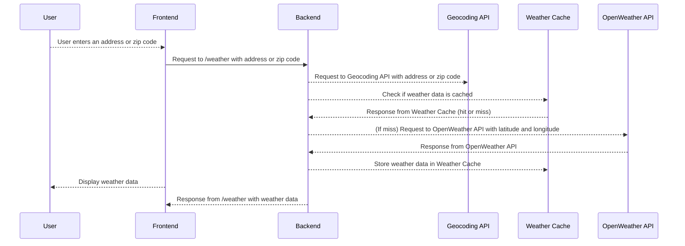

# Simple Weather App

## Overview

This is a simple weather app that allows you to search for weather data by address or zip code. It uses the OpenWeatherMap API to get the weather data, and Googles Geocoding API to get the latitude and longitude of the address.

## Demo


## Prerequisites

- Ruby 3.2.3
- Rails 7.0.4
- Node 20.12.0
- Docker / Docker Compose


## Configuration
Before running the app, you will have to get the `master.key` file from the admin user.

1. Clone the repository:
   ```
   git clone https://github.com/wilcoxky/sample-weather-app.git
   ```
2. Docker Development Setup
In the root of the project run `docker compose build`, this will create the base docker images.
The first build will take a while as it needs to install the dependencies. After the initial build the images will be cached and subsequent builds will be faster.

Next we need to setup the database, in the same directory as before run `docker compose run --rm --entrypoint "./bin/rails db:init" rails`

This will create the database and run the migrations.

If there are any errors running the migrations, you may need to delete the existing database and try again. Helpful commands to do this are `docker compose down -v` to delete the existing volumes.
Helpful commands to run in general are `docker compose run --rm --entrypoint "./bin/rails db:migrate" rails` to run migrations, `docker compose run --rm --entrypoint "./bin/rails db:seed" rails` to run seeds, and `docker compose run --rm --entrypoint "./bin/rails db:reset" rails` to run migrations, seeds, and rollback any migrations that may have failed.

To start the development server run `docker compose up -d`

Troubleshooting:

To access the rails console use `docker compose run --rm --entrypoint "./bin/rails c" rails`
To install a gem use `docker compose run --rm --entrypoint "./bin/bundle install" rails`
To install a node package use `docker compose run --rm --entrypoint "npm i" vite`


3. (Optional) Run on host machine
   ```
   bundle install
   npm i
   ./bin/rails s

   # In a new terminal
   ./bin/bundle exec vite dev
   ```

## Running the tests

To run the tests, run `docker compose run --rm --entrypoint "./bin/rails test" rails`

## Deployment
The application has a `Dockerfile` to containerize the application.

## Design Decisions

### React, Vite
In order to have hot reloading and a build process for the frontend I chose to use Vite. With the [vite-ruby-plugin](https://github.com/ElMassimo/vite_ruby) we can leverage the hot reloading of Vite and have a build process for production. With React being my frontend framework of choice, this was the best option. Along with the ability to use libraries like `@tanstack/react-router` and `@tanstack/react-query` which are both allow for quick development with TypeScript support to help scale.

### Tailwind, Shadcn
I chose to use Tailwind over a framework like Bootstrap due to the flexibility and the ability to have custom CSS. With Shadcn we get a UI library that is styled with Tailwind that is very easy to use and customize.

### Rails Structure
A bulk of the business logic is handled within services located in the `app/lib` directory. This is a decision I made to keep the controllers slim, and handle most of the logic within the services. I prefer to keep the controllers as a thin layer that just delegates to the services. This also allows for easy testing of the services.
For formatting and linting we use [Rubocop](https://github.com/rubocop/rubocop) for Ruby. The rubocop config is based on the [shopify style guide](https://shopify.github.io/ruby-style-guide/). This allows for a consistent style throughout the codebase. For the frontend we use [ESLint](https://eslint.org/) and [Prettier](https://prettier.io/) to format the JavaScript and TypeScript.

### Background Jobs
Due to the requirement of our requests to OpenWeather being cached for 30 mins, I choose [GoodJob](https://github.com/bensheldon/good_job) to handle the background jobs (i.e clearing the cache after 30 mins). GoodJob also allows for jobs to be configured in cron style to run on set intervals


### Caching
I chose to make a custom caching layer by adding a table WeatherCache to store the weather data. This allows us to cache the weather data and clear the cache when needed. It is deleted via a `GoodJob` background job that runs on a set interval checking for expired cache. I chose to use the existing database for simplicity and the current scale of the application. As queries become more complex and the application grows I would recommend using a more robust caching solution such as Redis.

### Data Flow Diagram

Here's a data flow diagram illustrating the interaction between different components of the system:




